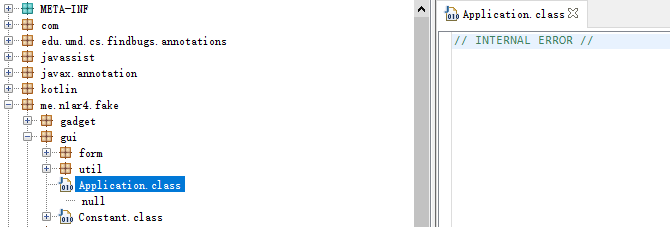
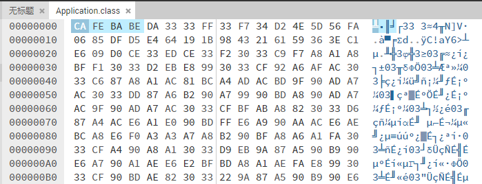
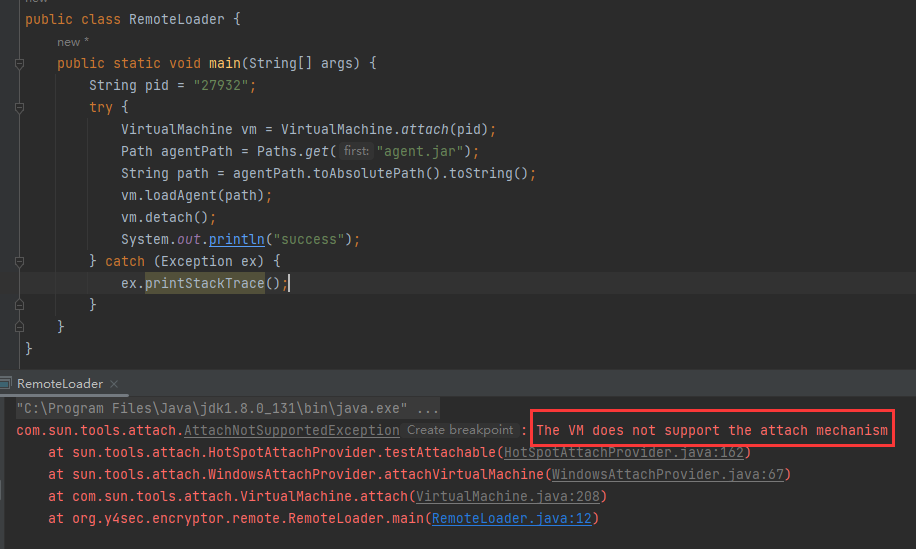
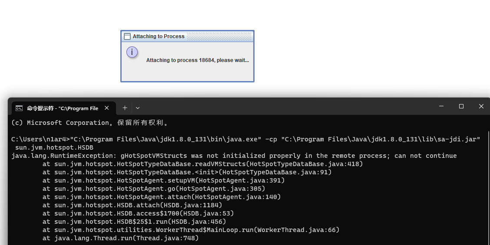
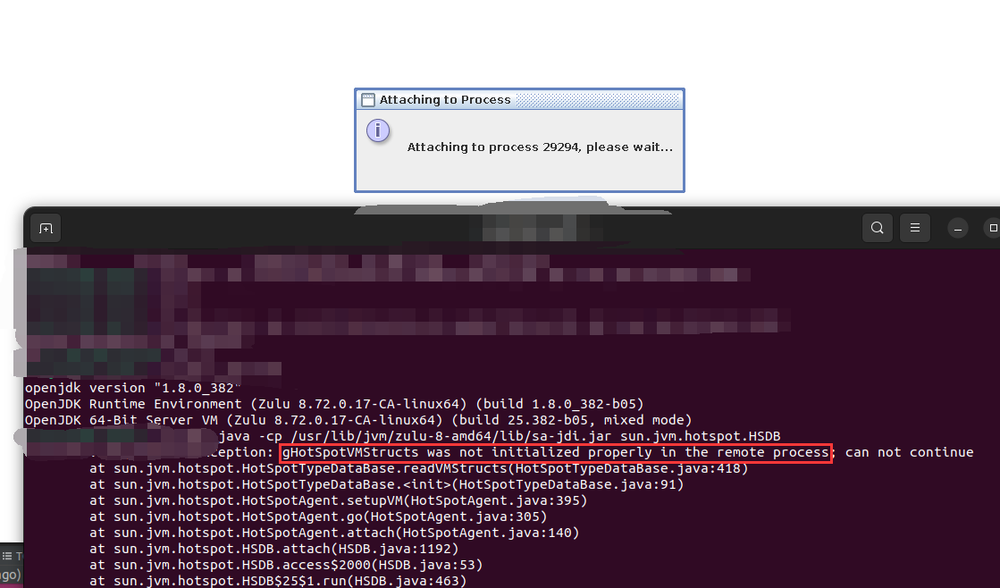
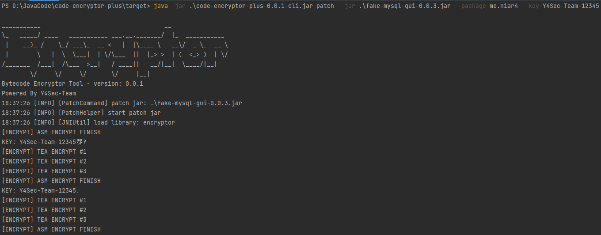
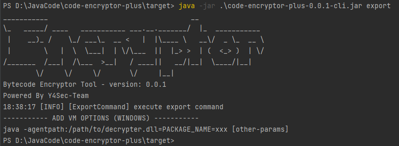
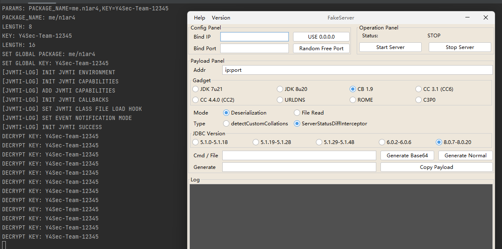

# code-encryptor-plus

[](https://github.com/Y4Sec-Team/code-encryptor-plus/releases/latest)


## 介绍

[English Doc](doc/README.md)

使用`JNI`加密字节码，通过`JVMTI`解密字节码以保护代码

提供两份`DLL`文件，一份加密一份解密，实际运行只需使用解密`DLL`文件，支持自定义密钥和包名

加密后的`Class`文件变成无法解析的畸形文件



除了开头保持了`Magic`部分，后续是无法解析的字节



使用指定参数启动即可禁止 `Java Agent` 动态 `dump` 字节码



对于更资深的黑客，他们会想到 `sa-jdi` 的 `HSDB` 来 `dump` 字节码

我参考 `Beichen` 师傅议题的思路，从 `JVM` 里禁用了 `gHotSpotVMStructs` 函数

支持 `Windows` 系统



支持 `Linux` 系统



## 快速开始

加密解密部分使用`C`做一层加密，使用`汇编`二层加密，已提供编译好的`Release`版本`DLL/SO`文件嵌入`Jar`包中

内置支持是`JDK-8`，其他版本的`JDK`只需要更换`JNI.h`头文件重新编译，新版本已支持`Windows`和`Linux`

加密你的`Jar`包：（指定`Jar`包和`package`加密包名以及密钥`key`）

```shell
 java -jar code-encryptor-plus.jar patch --jar your-jar.jar --package com.your.pack --key your-key
```



导出解密`DLL/SO`文件：（默认导出到`code-encryptor-plus-temp`目录不建议修改）

```shell
java -jar code-encryptor-plus.jar export
```



使用解密`DLL/SO`启动`Jar`包：（使用`-agentpath`参数）

注意必须有两个参数`PACKAGE_NAME`和`KEY`

```shell
java -XX:+DisableAttachMechanism -agentpath:D:\abs-path\decrypter.dll=PACKAGE_NAME=com.your.pack,KEY=your-key --jar your-jar.jar
```



另外支持了简易的`GUI`版本，选择需要加密的`Jar`文件即可一键加密（仅支持`Windows`版）


## 特点

本项目相比于网上公开的文章/代码，优势和特点有以下几条：
- 原文章固定了包名，用户想加密自己的包名需要重新编译`DLL`
- 原文章加密和解密`DLL`是同一个，这样只用`JNI`调用下加密即可破解
- 原文章的代码仅是`Demo`级别，无法直接上手测试和使用
- 原文章没有加入具体的加密算法，仅是简单的运算，需要加强
- 原文章的代码存在一些`BUG`和优化空间
- 使用某些魔法操作，使字节码无法被 `dump` 进一步保证安全

目前的加密解密算法：
- 汇编实现的多次位运算，交换字节等
- 基于`XXTEA`算法，多轮加密
- 支持自定义密钥，进一步保护

## 构建

编译环境：
- Windows 11 / Ubuntu 22.04
- JDK 8 / Maven
- MSVC + ml64 (Windows) / gcc + nasm (Linux)
- CMake 3.x
- Python 3.x

`native`目录使用`cmake`构建，生成`dll`和`so`移动到`resources`中使用`Maven`构建

## 其他

不适用于启动扫描 `class` 的项目

## 参考

特别感谢 `BeichenDream` 师傅

感谢以下项目或文章提供的思路：
- https://mp.weixin.qq.com/s/89Bmvy_uY97TZm3vR9lyWw
- https://juejin.cn/post/6844903487784894477
- https://github.com/sea-boat/ByteCodeEncrypt
