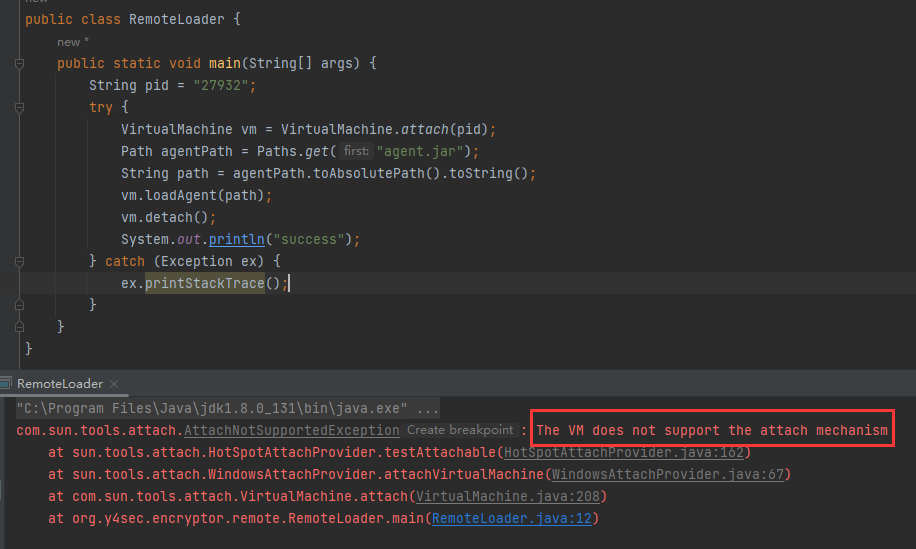
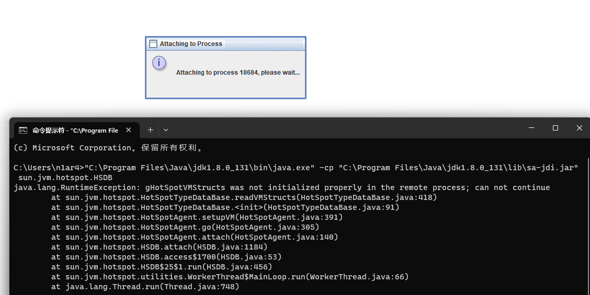
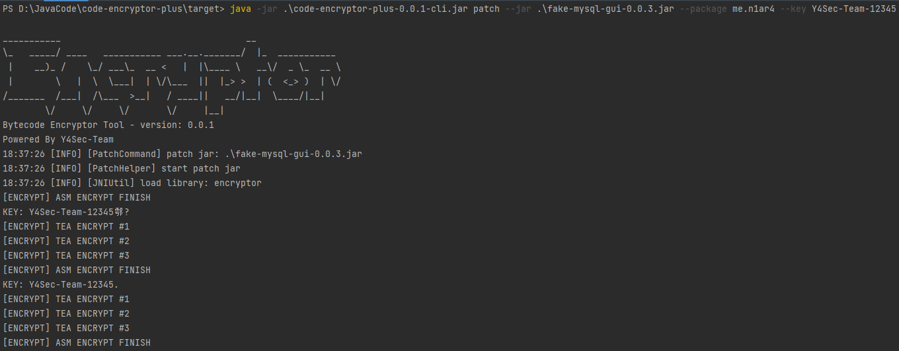
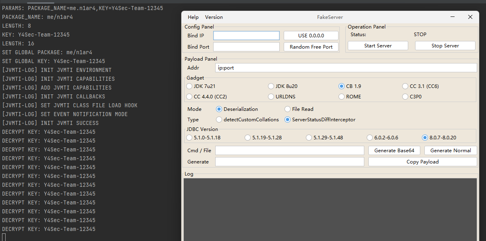

# code-encryptor

[](https://github.com/4ra1n/code-encryptor/releases/latest)


## Introduction

Encrypt bytecode using `JNI`, and decrypt it via `JVMTI` to protect the code.

Provides two `DLL` files, one for encryption and the other for decryption. For actual operation, only the decryption `DLL` is needed. Supports custom keys and package names.

The encrypted `Class` files become malformed and uninterpretable.


Apart from the initial `Magic` part, the subsequent bytes are uninterpretable.


Launching with specified parameters can prevent `Java Agent` from dynamically dumping the bytecode.



For more experienced hackers, they might think of using `sa-jdi`'s `HSDB` to dump the bytecode.

Taking inspiration from Master Beichen's discussion, I disabled the `gHotSpotVMStructs` function inside the `JVM`.

Supports `Windows` system.



Supports `Linux` system.


## Quick Start

The encryption and decryption use `C` for one layer of encryption and assembly for bitwise operation in the second layer. Compiled `Release` versions of `DLL/SO` files are provided to embed in the `Jar` package.

Built-in support is for `JDK-8`; other versions have not been tested. In theory, it requires replacing the `JNI.h` header file and recompiling. It supports both `Windows` and `Linux`.

Encrypt your `Jar` package: (Specify `Jar` package, `package` encryption package name, and `key`)

```shell
 java -jar code-encryptor.jar patch --jar your-jar.jar --package com.your.pack --key your-key
```



Export the decryption `DLL/SO` file: (Default export to `code-encryptor-temp` directory, not recommended to modify)

```shell
java -jar code-encryptor.jar export
```


Launch the `Jar` package with the decryption `DLL/SO`: (Use the `-agentpath` parameter)

Note that two parameters `PACKAGE_NAME` and `KEY` are required.

Note: In some cases, it may not start the first time. Repeat the command to start.

```shell
java -XX:+DisableAttachMechanism -agentpath:D:\abs-path\decrypter.dll=PACKAGE_NAME=com.your.pack,KEY=your-key --jar your-jar.jar
```



## Features

Compared to publicly available articles/codes on the internet, this project has the following advantages and features:
- The original article fixed the package name, requiring users who want to encrypt their own package names to recompile the `DLL`.
- In the original article, the encryption and decryption `DLL` were the same, making it vulnerable to simple `JNI` call decryption.
- The original article's code was only at the `Demo` level and not ready for direct testing and use.
- The original article lacked a specific encryption algorithm, only employing simple operations that needed strengthening.
- There were some `BUGs` and optimization spaces in the original article's code.
- Employing certain magic operations to prevent bytecode from being `dumped`, further ensuring security.

Current encryption and decryption algorithms:
- Multiple bitwise operations, byte swapping, etc.
- Based on the `XXTEA` algorithm, with multiple rounds of encryption.
- Supports custom keys for further protection.

## Building

Compilation Environment:
- Windows 11 / Ubuntu 22.04
- JDK 8 / Maven
- MSVC + ml64 (Windows) / gcc + nasm (Linux)
- CMake 3.x
- Python 3.x

## Others

Not suitable for projects that scan for `class` files at startup (typical projects like `SpringBoot`).

Currently working on solving this issue.

## References

Thanks to the following projects or articles for their ideas:
- https://mp.weixin.qq.com/s/89Bmvy_uY97TZm3vR9lyWw
- https://juejin.cn/post/6844903487784894477
- https://github.com/sea-boat/ByteCodeEncrypt