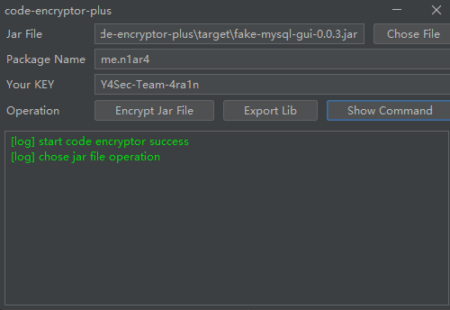

# code-encryptor-plus

[](https://github.com/Y4Sec-Team/code-encryptor-plus/releases/latest)


## Introduce

This project uses `JNI` to encrypt bytecode and `JVMTI` to decrypt bytecode in order to protect code.

It provides two `DLL` files: one for encryption and one for decryption. During actual execution, only the decryption `DLL` file is used. It supports custom keys and package names.

The encrypted `Class` files become malformed and cannot be parsed.


Apart from retaining the `Magic` part at the beginning, the rest becomes unrecognizable bytes.


Use some param to prevent `Java Agent` to `dump` byte code.


Some hackers may found `sa-jdi` and `HSDB` to `dump` byte code.

Refer to `Beichen` articles, prevent `gHotSpotVMStructs` function of `JVM`.

Support Windows:


Support Linux:


## Quick Start

The encryption and decryption process involves two layers of encryption: the first layer in `C` and the second layer in `assembly`. Precompiled `Release` versions of `DLL/SO` files are included in the `Jar` package.

Built-in support is for `JDK-8`, but other versions of `JDK` only require replacing the `JNI.h` header file and recompiling. The new version also supports both `Windows` and `Linux`.

To encrypt your `Jar` package (specify the `Jar` package, the package name to encrypt, and the encryption key):

```shell
java -jar code-encryptor-plus.jar patch --jar your-jar.jar --package com.your.pack --key your-key
```


When exporting the decryption `DLL/SO` files, they will be placed in the default export directory, which is `code-encryptor-plus-temp`. It is not recommended to modify this directory.

```shell
java -jar code-encryptor-plus.jar export
```


Launching the Jar Package with Decryption DLL/SO: (Using the `-agentpath` Parameter)

Please note that you must provide two parameters: `PACKAGE_NAME` and `KEY`.

Note: In some cases, the command may not start successfully the first time. Try running the command multiple times to resolve the issue.

```shell
java -XX:+DisableAttachMechanism -agentpath:D:\abs-path\decrypter.dll=PACKAGE_NAME=com.your.pack,KEY=your-key --jar your-jar.jar
```


We also offer a straightforward GUI version that allows you to encrypt your chosen `Jar` file with a single click. (Available for Windows only)



## Features

Compared to publicly available articles/code online, this project has several advantages and features:

- The original article had a fixed package name, and users who want to encrypt their own package names need to recompile the `DLL`.
- The original article used the same encryption and decryption `DLL`, making it easier to crack by simply calling encryption using `JNI`.
- The original article's code was only at a demo level, making it difficult for users to test and use directly.
- The original article did not include specific encryption algorithms; it only involved simple operations and needed enhancement.
- The original article's code had some bugs and room for optimization.
- Use some magic that hackers can not dump any byte code.

The current encryption and decryption algorithm includes:

- Multiple bitwise operations implemented in assembly, byte swapping, and more.
- Based on the `XXTEA` algorithm with multiple rounds of encryption.
- Supports custom keys for further protection.

## Building

Compilation Environment:
- Windows 11 / Ubuntu 22.04
- JDK 8 / Maven
- MSVC + ml64 (Windows) / gcc + nasm (Linux)
- CMake 3.x
- Python 3.x

The `native` directory is built using `cmake`, generating `dll` and `so` files that are then moved to the `resources` directory for Maven to build.

## Notes

This approach is not suitable for scanning projects that involve launching the scanning of `class` files.

## Refer

Thanks to `BeichenDream`

Thanks for these articles:
- https://mp.weixin.qq.com/s/89Bmvy_uY97TZm3vR9lyWw
- https://juejin.cn/post/6844903487784894477
- https://github.com/sea-boat/ByteCodeEncrypt

